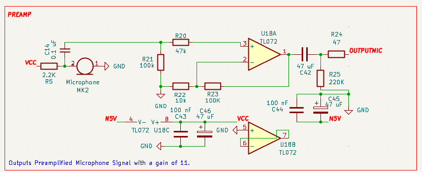
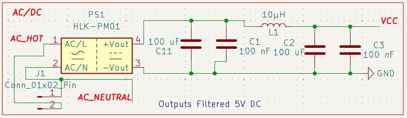
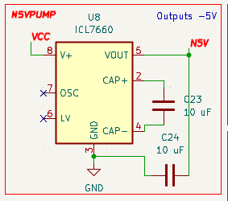
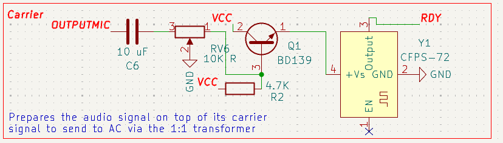
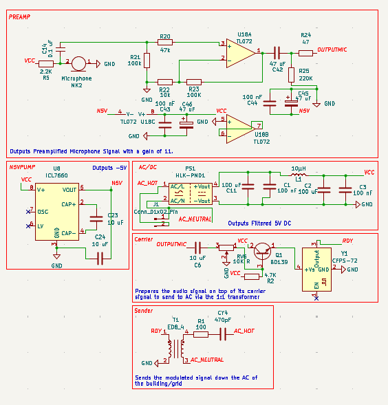
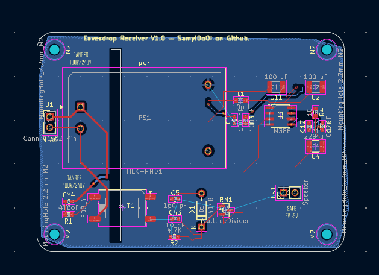
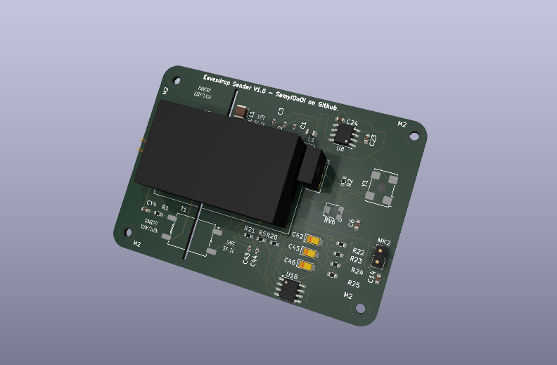

# Drawing the schematics | Journal Time: None (LAPSED)

`I like to admire a schematic after its finished; the diagram just seems watch-worthy...`

--------------

### The first thing that was needed to, you know, record and spy on someone's via a microphone, was guess what? A microphone and a micromp circuit. Luckily for this part I already had made it before on my project RetroCom. So I copied that and tweaked it and changed the gain to 11 to fit the new role (of literally being dumbed into the electricity of a building).

A picture of the PreAmp Circuit I'm talking about. 
Present in the sender circuit of Evasdrop.

### After that was sorted, I quickly tackled power by using an AC/DC Converter module. I knew I couldn't use a transormer and a regulator because that would be too heavy for this kind of "device" ofc. The module has a filter attached to deal with the bad signal noise.
 
 

### Additionally, the project uses another borrowed aspect from my project retrocom, the icl7660 pump to output -5V to be used in the preamp phase. Although I wouldn't really call it an "aspect" since its so simple.

## The most important part

### Now the question arises.. where are the new stuff? how does the system work? how did you apply it? 

### A really really simple, yet super effective (maybe not so simple) process is used. 

### First the voice is recorded and preamplified and the whole device is supplied from the outlet or whatever way its getting access to its ac source from. Afterwards that voice/sound is put through an oscillator so as to put it on a carrier wave. Afterwards that carrier wave is sent on the local AC with a 1:1 transformer. 

### Oscillation is done via a diode/transistor/crystal system as shown below

### After working on the schematic and debugging till i came to the final result shown above I started to think about the pcb. Which I ended up making two differnet pcbs, one for the transmission bug and another for the receive bug. remember bug just means espionage device in this context! 

### The sizes were 7*5 cm for each board. Which means these things can fit and bug practically any device that conencts to the wall.

### I expected the biggest in size to be the transformer but it actually turned out to be the AC/DC module by a massive margin.

## In the end I'd like to say that this project def opened my eyes on a whole new genre of things that I hope I will be able to develop later
 

 also time to write the readme and go to sleep... I'm barely awake its 6:07 AM. Have fun reviewer!

https://lapse.hackclub.com/timelapse/ORzzZJmxVIvP

https://lapse.hackclub.com/timelapse/vQRUEF0Iv1QD

https://lapse.hackclub.com/timelapse/8wdrSyqmCmyq

https://lapse.hackclub.com/timelapse/1Zpe0rNPwKQ_

https://lapse.hackclub.com/timelapse/MasJyytMrEYQ

# Made for Hack Club Live YSWS with love <3 (& a lack of sleep.)