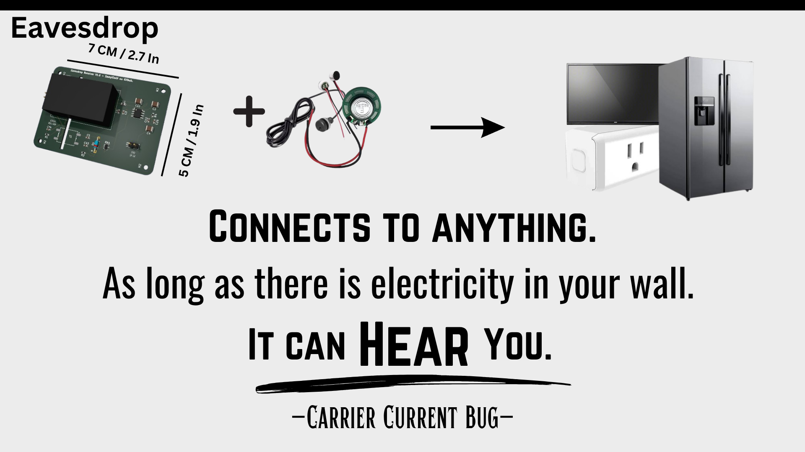
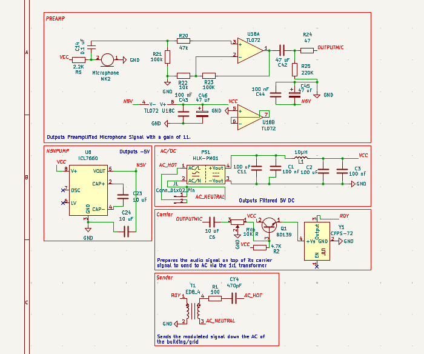
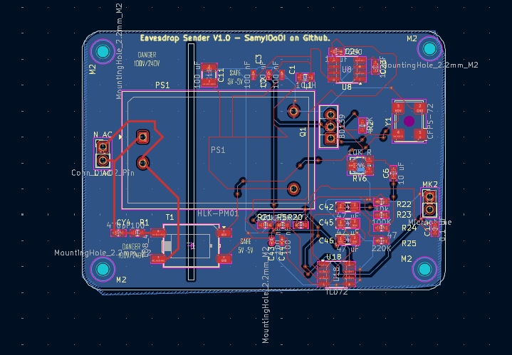
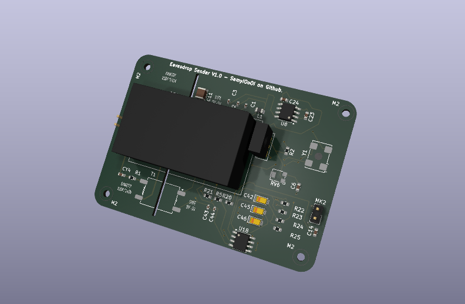
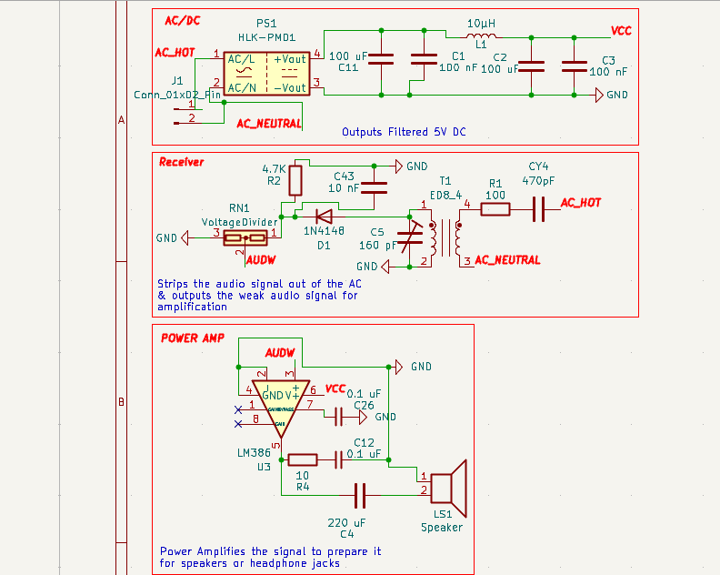
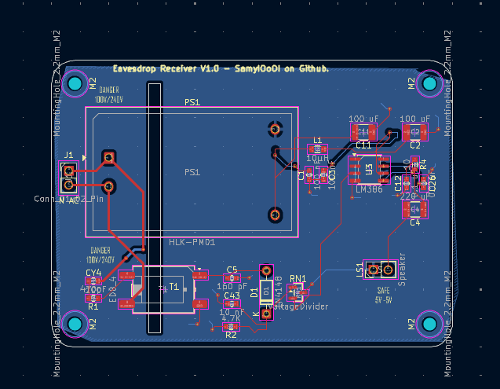
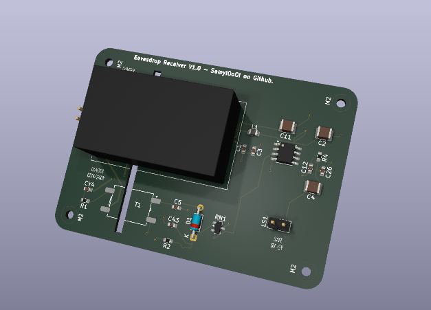

<h1 align="center">Eavesdrop</h1>

### 
[Main Features](#main-features) **-** [Usage](#usage-of-eavesdrop) **-** [PCB & Schematic](#design) **-** [Gerber Files](/Eavesdrop/Gerber%20Files/) **-** [Kicad (Schematic & PCB)](/Eavesdrop/Kicad%20Source%20Files/)  **-** [BOM](#bom)  **-** [BOM (File)](/BOM/evasdrop.xlsx) **-** [Credits](#credits)

## How would you feel if your own fridge was spying on you? Maybe even your tv, maybe the fryer, maybe the wall outlet you charge this device with. maybe even your charger. Well that could very well be a carrier bug. Just like Eavesdrop.

*A "current carrier bug" is a spy tool that records the sound inside the area its plugged in and sends it back through the AC power its connected to directly, evading most detection devices available in the market that rely on RF to detect these devices.*

----------------

**
No matter where you are. The bug listens as long as there's electricity flowing in the bugged device.
**

---------------

## Main Features

- Undetectable (via RF Detectors that are commonly used)
- Secretive (but requires prior access to the room)

- **Can be planted into any device, your lamp, your tv, your pc, ANYTHING can become a bug with one plug.**

## Usage of Eavesdrop

1- Insert it into the outlet or any device that takes in power from the wall and make sure the microphone jack is connected to proper microphone element such as an electret mic.

2- Connect the passive & active AC wires to their respective locations via the male header on the pcb, each header reads if its N (neutral) or L (live). 
Reversal could cause irreversible damage. Use a test screw driver to make sure you're connecting the right ones.

3- connect the receiver , when required to listen to the broadcast, to an outlet that is in the same grid as the target room/building.

4- Make sure that both the receiver and the sender are at the same wavelength via calibration. Refer to the schemati for more details.

5- Use the volume control knob to increase/decrease th sound level.

 

Note that usage of Eavesdrop or any other spying device is illegal when taken out of personal hobby boundaries and used beyond one's own property. (If your device bleeds into the grid of neighbouring properties you may still be fined.)    I hold no responsiblity on the misuse of this project for illegal activities such as but not limited to: Unathorized Surveillance, Stalking, and damage to property.  My work is done for the sake of open-sourcing, eduction and self-learning. Not to inflict harm.

## Design

Eavesdrop Sender Schematic

Eavesdrop Sender PCB

Eavesdrop Sender PCB (Model)

Eavesdrop Receiver Schematic

Eavesdrop Receiver PCB

Eavesdrop Receiver PCB (Model)

## BOM

| **Part Name**                           | **Quantity** | **Price** | **Link**                                                                                                   |
|-----------------------------------------|--------------|-----------|------------------------------------------------------------------------------------------------------------|
| **2.54mm 1x2 Pin Header**               | 2            | 89.04     | https://www.digikey.com/en/products/detail/samtec-inc/TSW-102-26-S-S/1103922                               |
| **Capacitor 0.1 uF**                    | 3            | 41.93     | https://www.digikey.com/en/products/detail/vishay-beyschlag-draloric-bc-components/K104K10X7RF5UH5/2356754 |
| **Capacitor 10 nF**                     | 1            | 5.18      | https://www.digikey.com/en/products/detail/samsung-electro-mechanics/CL21B103KBANNNC/3886673               |
| **Capacitor 10 uF**                     | 3            | 29.51     | https://www.digikey.com/en/products/detail/kemet/ESK106M050AC3DA/13176616                                  |
| **Capacitor 100 nF**                    | 6            | 83.87     | https://www.digikey.com/en/products/detail/vishay-beyschlag-draloric-bc-components/K104K10X7RF5UH5/2356754 |
| **Capacitor 100 uF**                    | 4            | 115.96    | https://www.digikey.com/en/products/detail/rubycon/35TZV100M6-3X8/3134900                                  |
| **Capacitor 160 pF**                    | 1            | 1.09      | https://www.digi-electronics.com/en/products/detail/murata-electronics/GCM1885C2A161JA16D/7169978.html     |
| **Capacitor 220 uF**                    | 1            | 31.76     | https://www.lcsc.com/product-detail/C133440.html                                                           |
| **Capacitor 47 uF**                     | 3            | 65.23     | https://www.digikey.com/en/products/detail/rubycon/63ZLJ47M6-3X11/3134467                                  |
| **Capacitor 470pF**                     | 2            | 1.00      | https://uge-one.com/product/ceramic-capacitor-470pf/                                                       |
| **Condenser Microphone**                | 1            | 6.00      | https://makerselectronics.com/product/condenser-microphone-2-pins/                                         |
| **Crystal/Oscillator CFPS-72**          | 1            | 168.77    | https://www.digikey.com/en/products/detail/ecs-inc/ECS-100AX-035/827253                                    |
| **Diode 1N4148**                        | 1            | 5.18      | https://www.digikey.com/en/products/detail/onsemi/1N4148/458603                                            |
| **IC ICL7660**                          | 1            | 51.30     | https://uge-one.com/product/icl7660/                                                                       |
| **IC LM386**                            | 1            | 55.91     | https://www.digikey.com/en/products/detail/texas-instruments/LM386N-1-NOPB/6284                            |
| **IC TL072**                            | 1            | 24.48     | https://www.lcsc.com/product-detail/C7236.html                                                             |
| **Inductor 10µH**                       | 2            | 11.39     | https://www.digikey.com/en/products/detail/tdk/MLZ2012M100WTD25/4743190                                    |
| **Potentiometer 10K**                   | 1            | 96.29     | https://www.digikey.com/en/products/detail/tt-electronics-bi/P160KN-0QD15B10K/2408885                      |
| **Power Supply HLK-PM01 (AC-DC 5V 3W)** | 2            | 320.00    | https://makerselectronics.com/product/hlk-pm01-ac-dc-power-module/                                         |
| **Resistor 10**                         | 1            | 0.15      | https://makerselectronics.com/product/carbon-resistor-10%cf%89-0-25w-through-hole/                         |
| **Resistor 100**                        | 2            | 2.50      | https://uge-one.com/product/resistor-1w-carbon-film-5-tolerance-100r-ohm/                                  |
| **Resistor 100K**                       | 2            | 0.30      | https://makerselectronics.com/product/carbon-resistor-100k-0-25w/                                          |
| **Resistor 10K**                        | 1            | 0.10      | https://makerselectronics.com/product/carbon-resistor-10k%cf%89-0-125w-through/                            |
| **Resistor 2.2K**                       | 1            | 0.10      | https://makerselectronics.com/product/carbon-resistor-2-2k%cf%89-0-125w-through-hole/                      |
| **Resistor 220K**                       | 1            | 0.15      | https://makerselectronics.com/product/carbon-resistor-220k%cf%89-0-25w-through-hole/                       |
| **Resistor 4.7K**                       | 2            | 0.50      | https://uge-one.com/product/carbon-resistor-0-25w-4-7k-ohm/                                                |
| **Resistor 47**                         | 1            | 1.00      | https://makerselectronics.com/product/carbon-resistor-47%cf%89-2w-through-hole/                            |
| **Resistor 47K**                        | 1            | 0.15      | https://makerselectronics.com/product/carbon-resistor-47k%cf%89-0-25w/                                     |
| **Resistor VOLTAGEDIVIDER**             | 1            | 0.15      | https://makerselectronics.com/product/carbon-resistor-100k-0-25w/                                          |
| **Speaker**                             | 1            | 60.00     | https://makerselectronics.com/product/speaker-8-ohm-10w-125x60mm/                                          |
| **Transformer ED8_4**                   | 2            | 755.84    | https://www.digikey.com/en/products/detail/pulse-electronics/HX0068ANL/3025742                             |
| **Transistor BD139**                    | 1            | 4.50      | https://makerselectronics.com/product/bd139-1-5a-80v-npn-bipolar-power-transistor-to-126/                  |
| **Total**                               |              | 2029.33 EGP  |                                                                                                            |

*Credits: BOM converted from XLSX to md on tableconvert.com*

## Credits

Made by SamyIOoOI on github under the GPL 3.0 Licence.

